// Add steps as necessary for accessing the software, post-configuration, and testing. Don’t include full usage instructions for your software, but add links to your product documentation for that information.
//Should any sections not be applicable, remove them

== Test the deployment
When the AWS CloudFormation template successfully created the stack, all server nodes ran with the software installed in your AWS account. In the following steps, connect to {partner-product-short-name} web client to verify the deployment, and then use the web client to explore {partner-product-short-name} features.

.  To access the {partner-product-short-name} web client, go to the *ICPDWebClientURL* output of the root stack as shown in <<cfn_outputs>>. For a list of supported browsers, see
https://www.ibm.com/support/producthub/icpdata/docs/content/SSQNUZ_current/cpd/plan/rhos-reqs.html#rhos-reqs__web[Supported web browsers].
.  A new tab opens in your browser. If you configured the hostname resolution for the cluster DNS name in the URL, you will see either the {partner-product-short-name} web client login page or a warning from your browser that the HTTPS connection is unsafe. By default, the public key infrastructure (PKI) certificate that is created for the {partner-product-short-name} cluster is self-signed, leading to the unsafe connection warning from your browser.
.  Log in to the {partner-product-short-name} web client by using the default administrator and the password you supplied when creating the stack.
.  Once you log in, the welcome page is displayed as shown in <<cpdwelcomepage>>.

:xrefstyle: short
[#cpdwelcomepage]
.Welcome page for {partner-product-short-name} web client
[link=images/image8.png]
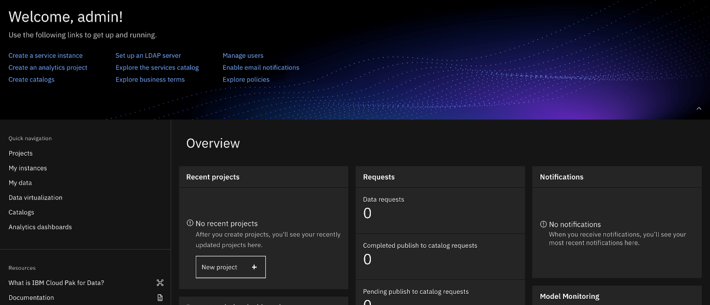

For resources on platform features and capabilities, see the https://docs-icpdata.mybluemix.net/home[{partner-product-short-name} product hub^]. To understand its capabilities, see the https://docs-icpdata.mybluemix.net/resources[video tutorials^].

== Post deployment steps
// If Post-deployment steps are required, add them here. If not, remove the heading

=== Manage your cluster using the OpenShift Console
To access the {partner-product-short-name} web client, go to the *OpenShiftUI* output of the root stack.

The default OpenShift administrator name is *kubeadmin.* The password can be obtained from the OpenShiftSecret resource.

:xrefstyle: short
[#ocpsecret]
.OpenShift secret resource
[link=images/image9.png]
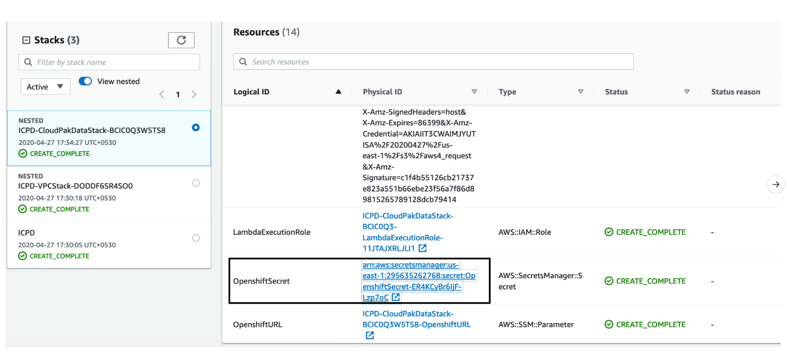

You can retrieve the secret value by choosing *Retrieve secret value*, as shown. Use the OpenShift console administrative password.

:xrefstyle: short
[#ocppassword]
.Retrieve secret value for console password
[link=images/image10.png]
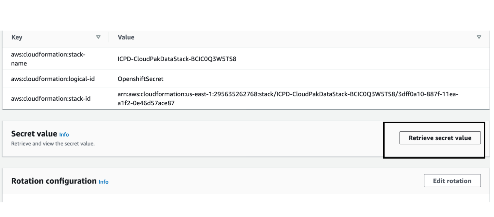


==== (Optional) Provide boot-node SSH access

The boot-node instance is used for certain command-line cluster administration tasks, such as adding compute nodes. SSH access to the boot node is required for some cluster administrators.

After deployment, you only have access to the boot node. Provide the workstation IP address CIDR as the value of the `BootNodeSecurityGroup` rule.

This section describes the steps to modify the `BootNodeSecurityGroup` inbound rules.

Note: These steps assume access to the AWS CloudFormation console for the {partner-product-name} deployment.

.  In the list of stacks created viewing the nested stacks, choose the *CloudPakDataStack* stack.
+
:xrefstyle: short
[#ocpstack]
.OpenShift stack
[link=images/image11.png]
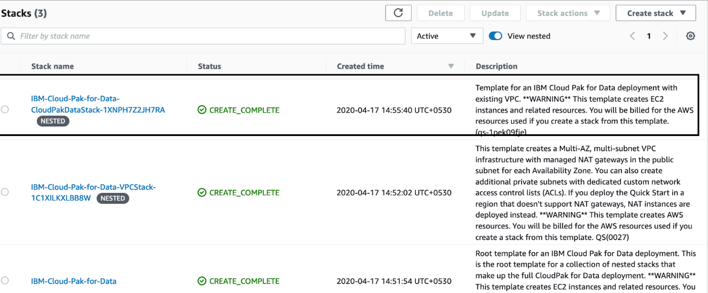
+
.  In the stack window, choose the *Resources* tab, and choose *BootnodeSecurityGroup*.
+
:xrefstyle: short
[#bootnodeSG]
.Boot node security group
[link=images/image12.png]
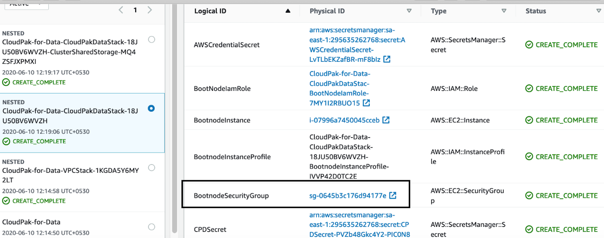
+
. The security group window displays the ingress rules. On the *Inbound* tab, choose *Edit* to bring up the rule editor.
+
:xrefstyle: short
[#inboundrules]
.Editing inbound rules
[link=images/image13.png]
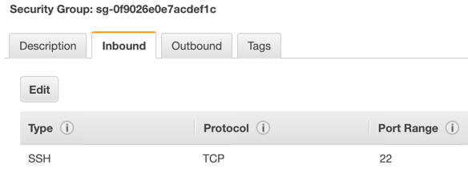
+
.  Choose *Add rule*, and fill in the rule details. Add the network CIDR for the group of IP addresses that you want to permit SSH access to the boot nodes. To allow any IP address, use 0.0.0.0/0.
+
:xrefstyle: short
[#inboundruledetails]
.Supplying rule details
[link=images/image14.png]
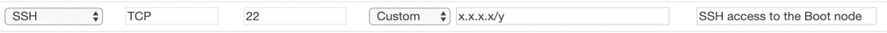

=== Accessing the control plane through the boot node

To use SSH access on the OpenShift cluster instances via the bastion host, use SSH agent forwarding, as in the following bash instructions.

.  Run the command ssh-add -K <your-key.pem> to store the key in your keychain. On Linux, you must omit the -K flag.
.  Retrieve the hostname of the boot node from the Amazon EC2 console.
+
:xrefstyle: short
[#bootnodename]
.Hostname of the boot node
[link=images/image15.png]
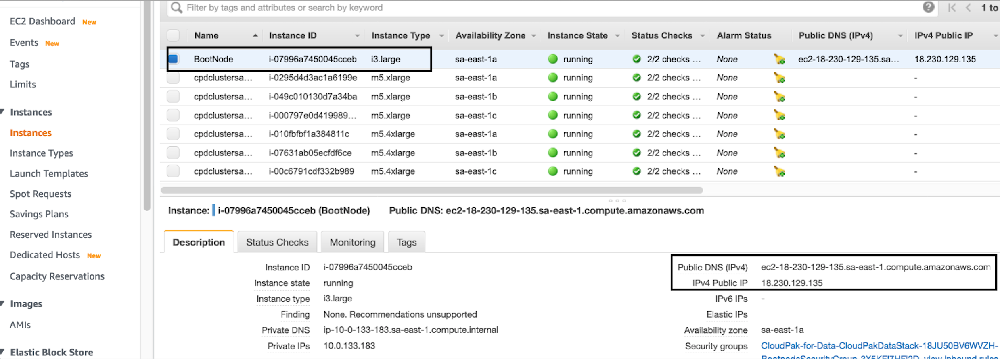
+
.  To log in to the bastion host, run ssh -A ec2-user@<bootnode-host-name>.
.  Run sudo to become root:
+
```
$ sudo -s
```
+
.  To authenticate, run oc login with OpenShift and then oc get pods. Verify that the services are running.
+
```
$ oc login
$ oc get pods
```

== Best practices for using {partner-product-short-name} on AWS
// Provide post-deployment best practices for using the technology on AWS, including considerations such as migrating data, backups, ensuring high performance, high availability, etc. Link to software documentation for detailed information.

=== Scale up your cluster by adding compute nodes

.  Run `oc nodes` to get the current list of nodes.
.  Run `oc get machineset -n openshift-machine-api` to get the machine sets for each Availability Zone.
+
:xrefstyle: short
[#machinesets]
.Machinesets output
[link=images/image16.png]
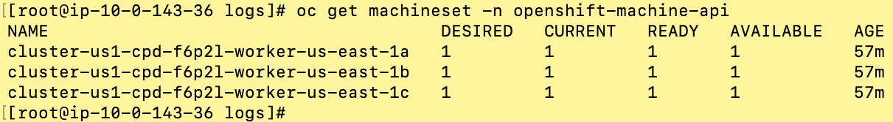
+
.  From the list returned in the previous command, choose the machine set to scale up.
.  Edit the machine set, and update the replica count.
+
```
oc edit machineset cluster-us1-cpd-f6p2l-worker-us-east-1a -n openshift-machine-api
```
+
:xrefstyle: short
[#editmachineset]
.Edit Machineset
[link=images/image17.png]
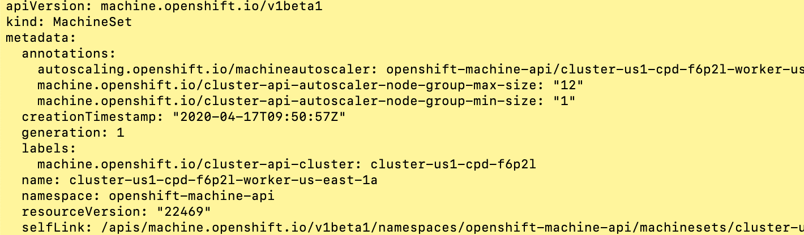
+
.  An AWS instance is created and desired count and current count are updated to the replica value.
.  After a few minutes, once the node joins the cluster, the available count is updated to the replica value.

NOTE: If you choose to scale down your cluster or reduce the number of compute nodes, there is a risk of the cluster becoming unstable because pods must be rescheduled. Scaling down the worker nodes is not a recommended option.

The cluster auto scaler can overrule scaling activity to maintain the required threshold.

=== {partner-product-short-name} services

For more information about available services for {partner-product-short-name}, see https://www.ibm.com/support/producthub/icpdata/docs/content/SSQNUZ_current/cpd/svc/services.html[IBM services in the catalog^].

:xrefstyle: short
[#serviceCatalog]
.Services catalog page in {partner-product-short-name}
[link=images/image18.png]
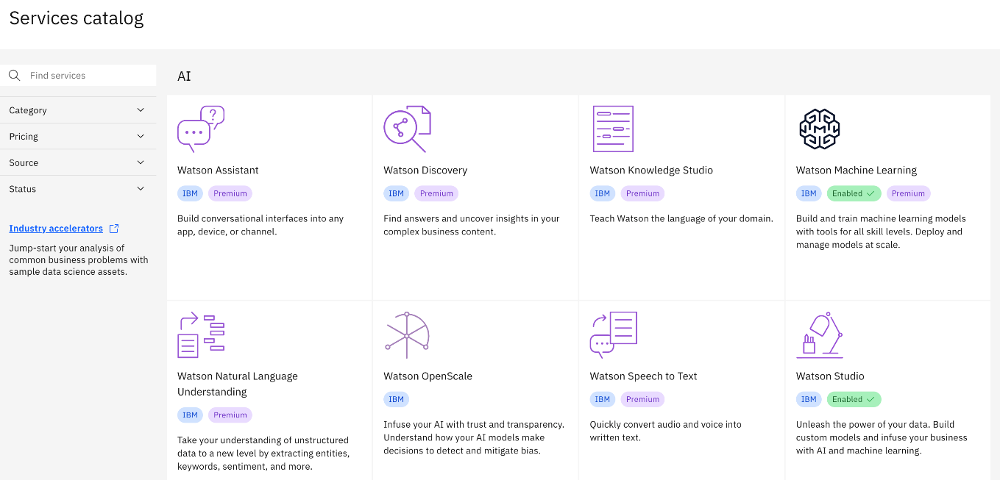

As part of the Quick Start installation, the control plane is installed by default, and the following services can be enabled while creating the stack:

* Watson Studio
* Watson Knowledge Catalog
* Watson Machine Learning
* Data Virtualization
* Watson OpenScale
* Cognos Dashboards Embedded
* Analytics Engine for Apache Spark

==== System requirements for each service

[cols=",,",options="header",]
|====================================================
|Service name |CPU cores(vCPUs) |Memory
|Watson Studio Local (non-HA) |12 |48 GB
|Watson Knowledge Catalog (small, non-HA) |26 |104 GB
|Watson Machine Learning (small) |16 |64 GB
|Data Virtualization (small) |16 |64 GB
|Watson OpenScale (small, includes WML) |30 |120 GB
|Spark Engine |7 |28 GB
|Cognos Dashboard Engine |4 |16 GB
|====================================================

==== Install a service

. Log in to your boot-node server as mentioned in link:#accessing-the-control-plane-through-the-boot-node[access section].
.  Change to the install directory.
.  Run `$ cd /ibm`.
.  Run the following commands.
+
```
$ ./cpd-linux adm -r ./repo.yaml -a <Service Name> -n <Project Name> --apply

$ ./cpd-linux -c <Storage Class> -r ./repo.yaml -a lite -n <Project Name> --transfer-image-to $(oc get route -n openshift-image-registry | tail -1| awk '\{print $2}')/<Project Name> --target-registry-username $(oc whoami | sed 's/://g') --target-registry-password $( oc serviceaccounts get-token cpdtoken) --cluster-pull-prefix image-registry.openshift-image-registry.svc:5000/<Project Name> -o override.yaml --insecure-skip-tls-verify
```
For information about other available services, see the https://www.ibm.com/support/producthub/icpdata/docs/content/SSQNUZ_current/cpd/svc/services.html[{partner-product-short-name} Service Catalog^].

== Other useful information
//Provide any other information of interest to users, especially focusing on areas where AWS or cloud usage differs from on-premises usage.

=== Limitations
* For the list of supported versions, see the {partner-product-short-name} version (ICPDVersion) parameter in link:#_parameter_reference[Parameter reference] section.
* The only browsers supported are Google Chrome (version 60 or higher) and Mozilla Firefox (version 54 or higher).
* Deploying a {partner-product-short-name} cluster with dedicated infrastructure nodes is not currently supported.
* Review the https://www.ibm.com/support/producthub/icpdata/docs/content/SSQNUZ_current/cpd/overview/known-issues.html[known issues and limitations^] for {partner-product-short-name}.
