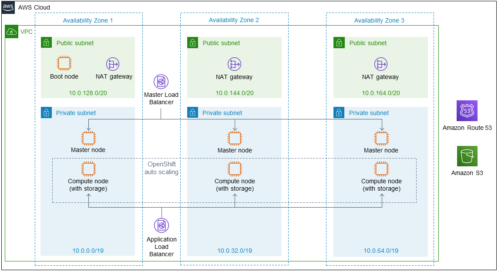
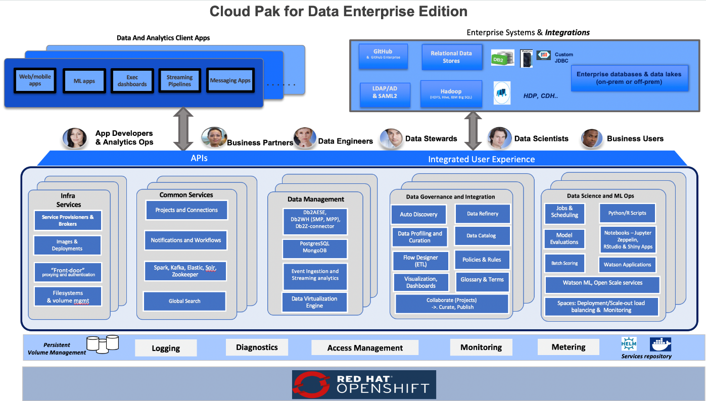

Deploying this Quick Start for a new virtual private cloud (VPC) with
default parameters builds the following {partner-product-short-name} environment in the
AWS Cloud.

// Replace this example diagram with your own. Send us your source PowerPoint file. Be sure to follow our guidelines here : http://(we should include these points on our contributors giude)
:xrefstyle: short
[#architecture1]
.Quick Start architecture for {partner-product-short-name} on AWS

As shown in <<architecture1>>, the Quick Start sets up the following:

* A highly available architecture that spans one or three Availability Zones.*
* A VPC configured with public and private subnets, according to AWS best practices, to provide you with your own virtual network on AWS.*
* In the public subnets:
** A boot node Amazon Elastic Compute Cloud (Amazon EC2) instance that also serves as a bastion host to allow inbound Secure Shell (SSH) access to EC2 instances in the private subnets.
** Managed network address translation (NAT) gateways to allow outbound internet access for resources in the private subnets.*
* In the private subnets:
** OpenShift Container Platform (OCP) master nodes in up to three Availability Zones.
** OCP compute nodes that combine services by {partner-product-short-name} (Collect, Organize, and Analyze).
** For container-persistent data, Elastic Block Store disks that are mounted on the compute nodes.
* A Master Load Balancer, which spans the private subnets, for accessing the OCP compute nodes. This provides web-browser access to {partner-product-short-name}.
* An Application Load Balancer, which spans the private subnets, for accessing the OCP compute nodes.
* https://docs.openshift.com/container-platform/4.3/machine_management/applying-autoscaling.html[OpenShift auto scaling^] for the OCP compute nodes.
* Amazon Route 53, as your public Domain Name System (DNS), for resolving domain names for the {partner-product-name} management console.
* Amazon S3 for storing the pull secret and deployment logs.

*The template that deploys the Quick Start into an existing VPC skips the components marked by asterisks and prompts you for your existing VPC configuration.

{partner-product-short-name} microservices are preconfigured on compute nodes. The following diagram shows the platform architecture.

:xrefstyle: short
[#cpdservices]
.{partner-product-short-name} services

